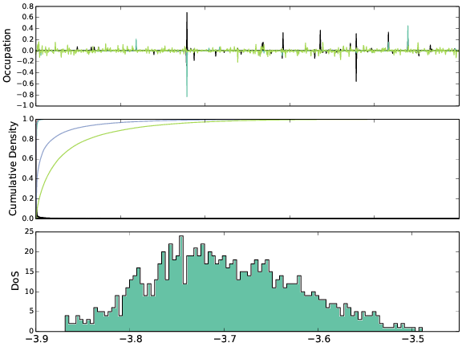

# PCBM-CG-DoS
PCBM Coarse Grain Density of States; Beth Rice's project

This code is designed to analyse disordered assemblies of Carbon-60 derivatives, 
calculating the density of states at a tight binding level from a molecular dynamics snapshot.
